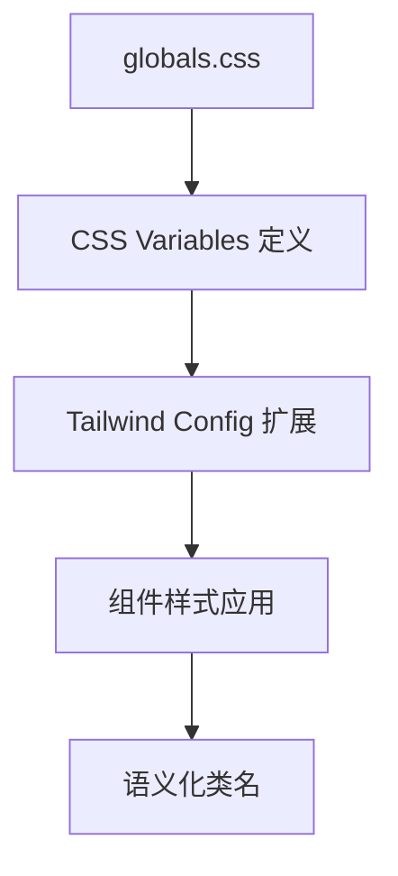

## Product Overview

将现有项目中硬编码的 Tailwind CSS 颜色类（如 `bg-blue-500`、`text-gray-700` 等）重构为 shadcn/ui 风格的语义化 CSS 变量 Token，实现样式的统一管理和规范化。

## Core Features

- 定义 shadcn/ui 风格的语义化 CSS 变量 Token 体系（primary、secondary、muted、accent、destructive 等）
- 扫描并识别项目中所有硬编码的 Tailwind 颜色类
- 建立颜色映射关系，将硬编码颜色替换为语义化 Token
- 仅支持亮色模式，不需要暗色模式切换
- 确保重构后视觉效果与原有设计保持一致

## Tech Stack

- 前端框架：React + TypeScript（沿用现有项目技术栈）
- 样式方案：Tailwind CSS + CSS Variables
- 组件库：shadcn/ui 语义化 Token 规范

## Architecture Design

### 系统架构

采用 CSS 变量层级架构，在全局样式文件中定义语义化 Token，通过 Tailwind CSS 的扩展机制将 Token 集成到工具类中。



### 模块划分

| 模块 | 职责 | 关键文件 |
| --- | --- | --- |
| Token 定义层 | 定义所有语义化 CSS 变量 | `globals.css` |
| Tailwind 扩展层 | 将 CSS 变量映射为 Tailwind 工具类 | `tailwind.config.ts` |
| 组件应用层 | 使用语义化类名替换硬编码颜色 | 各组件文件 |


### Token 命名规范

遵循 shadcn/ui 语义化命名体系：

```css
:root {
  --background: 0 0% 100%;
  --foreground: 222.2 84% 4.9%;
  --card: 0 0% 100%;
  --card-foreground: 222.2 84% 4.9%;
  --popover: 0 0% 100%;
  --popover-foreground: 222.2 84% 4.9%;
  --primary: 222.2 47.4% 11.2%;
  --primary-foreground: 210 40% 98%;
  --secondary: 210 40% 96.1%;
  --secondary-foreground: 222.2 47.4% 11.2%;
  --muted: 210 40% 96.1%;
  --muted-foreground: 215.4 16.3% 46.9%;
  --accent: 210 40% 96.1%;
  --accent-foreground: 222.2 47.4% 11.2%;
  --destructive: 0 84.2% 60.2%;
  --destructive-foreground: 210 40% 98%;
  --border: 214.3 31.8% 91.4%;
  --input: 214.3 31.8% 91.4%;
  --ring: 222.2 84% 4.9%;
  --radius: 0.5rem;
}
```

### 颜色映射策略

| 原硬编码颜色 | 语义化 Token | 用途 |
| --- | --- | --- |
| `blue-500/600` | `primary` | 主要操作、品牌色 |
| `gray-100/200` | `muted` | 次要背景、禁用状态 |
| `gray-500/600` | `muted-foreground` | 次要文本 |
| `red-500/600` | `destructive` | 错误、删除操作 |
| `green-500` | `accent` | 强调、成功状态 |
| `white` | `background` | 页面背景 |
| `gray-900` | `foreground` | 主要文本 |


## Implementation Details

### 核心目录结构

```
src/
├── app/
│   └── globals.css          # CSS 变量 Token 定义
├── components/
│   └── ui/                   # 需要重构的组件
└── tailwind.config.ts        # Tailwind 扩展配置
```

### Tailwind 配置扩展

```typescript
// tailwind.config.ts
export default {
  theme: {
    extend: {
      colors: {
        background: "hsl(var(--background))",
        foreground: "hsl(var(--foreground))",
        primary: {
          DEFAULT: "hsl(var(--primary))",
          foreground: "hsl(var(--primary-foreground))",
        },
        secondary: {
          DEFAULT: "hsl(var(--secondary))",
          foreground: "hsl(var(--secondary-foreground))",
        },
        muted: {
          DEFAULT: "hsl(var(--muted))",
          foreground: "hsl(var(--muted-foreground))",
        },
        accent: {
          DEFAULT: "hsl(var(--accent))",
          foreground: "hsl(var(--accent-foreground))",
        },
        destructive: {
          DEFAULT: "hsl(var(--destructive))",
          foreground: "hsl(var(--destructive-foreground))",
        },
        border: "hsl(var(--border))",
        input: "hsl(var(--input))",
        ring: "hsl(var(--ring))",
      },
      borderRadius: {
        lg: "var(--radius)",
        md: "calc(var(--radius) - 2px)",
        sm: "calc(var(--radius) - 4px)",
      },
    },
  },
}
```

### 替换规则示例

```
bg-blue-500    → bg-primary
text-blue-600  → text-primary
bg-gray-100    → bg-muted
text-gray-500  → text-muted-foreground
bg-red-500     → bg-destructive
text-white     → text-primary-foreground (在 primary 背景上)
bg-white       → bg-background
text-gray-900  → text-foreground
border-gray-200 → border-border
```

## Agent Extensions

### SubAgent

- **code-explorer**
- Purpose: 扫描项目中所有组件文件，识别并统计硬编码的 Tailwind 颜色类使用情况
- Expected outcome: 获取完整的颜色类使用清单，包括文件路径、行号和具体的颜色类名

### MCP

- **brave-search**
- Purpose: 查询 shadcn/ui 最新的 Token 规范和最佳实践
- Expected outcome: 获取官方推荐的 CSS 变量命名规范和配置方式